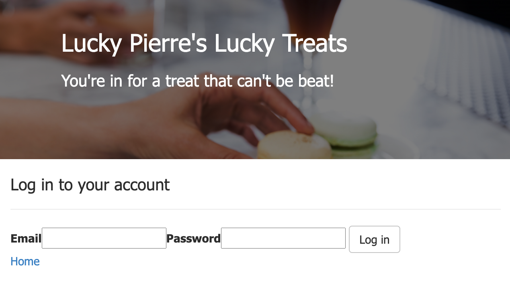
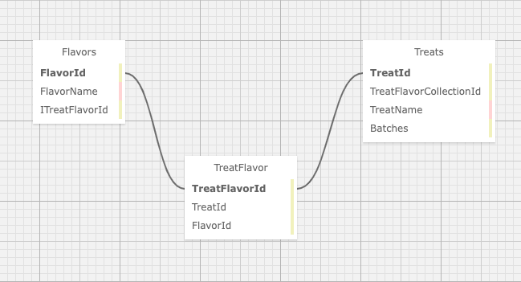

# _Lucky Pierre's Treat Shop_

#### _C#/.NET Project for [Epicodus](https://www.epicodus.com/), 2020.08.14_

#### By **Thomas Glenn**

## Description
A weekly code review project for Epicodus school, which allows the Pierre, an ambitious baker, and now candy maker, to manage and market his sweet and savory confections. This project demonstrates many-to-many-many database relationships, with user authentication. 




The following sitemap explains this database query relationship between Flavors and Treats in this schema.

## Database Structure


## Specifications

| Spec | Input | Output | 
|:--------- |:--------- |:-------- |
| The program will construct a database of Treats allowing the Pierre to make entries | "Treat" | "Cookie" | 
| The program will construct a database of Flavors allowing the Pierre to make entries | "Flavor"  | "Sweet" |
| The program will allow Pierre to view lists of Treats | "View Treats List" | "Chocolate Croissant", "Flan" |
| The program will allow Pierre to view lists of Flavors |  "View List of Flavors" | "Raspberry", "Caramel" |
| The program will allow Pierre to edit entries | "Cherry Pie" | "Rhubarb Pie" |
| The program will allow Pierre to delete entries | "Churros" | " " | 
| The Program will allow Pierre to restrict access to the database | "Read" | "Read Only" |

## Known Bugs
* No known bugs.   

## Setup/Installation Requirements
#### View Online
Visit the GitHub Pages by clicking on the following link or by typing it in your web browser. 
<url:>

https://github.com/thomasglenngit/Library.Solution

#### View locally

*[.NET Core](https://dotnet.microsoft.com/download/dotnet-core/2.2) is needed to run this application*

To clone this repository from your command line you will need [Git](https://git-scm.com/) installed. 

First navigate in the command line to where you want to clone this repository. 

Then from your command line run:

`$ git clone `

Once the repository has been cloned, navigate to the to the application directory and run `$ dotnet restore`.
Once 'restore' is run, enter `$ dotnet build`.

#### MySQL Setup
In order to view and use the functionality of this project you must,
1. Install MySQL on your computer. If you don't have it, you can download the .dmg file here:
https://dev.mysql.com/downloads/file/?id=484914. You'll need to create a password.

2. Install MySQL Workbench on your computer. If you don't have it, you can download it here:
https://dev.mysql.com/downloads/file/?id=484391.

3. Open MySQL Workbench and select the Local instance 3306 server. 

#### Importing this file:
1. Open your MySQL Workbench. In the Navigator > Administration window, select Data Import/Restore.

2. In Import Options select Import from Self-Contained File.

3. Navigate to `thomas_glenn`.

Under Default Schema to be Imported To, select the New button.

Enter the name of your database with _test appended to the end.
In this case thomas_glenn_test.
Click Ok.
Click Start Import.

Reopen the Navigator > Schemas tab. Right click and select Refresh All. Our new test database will appear.

#### Query
The following is the query information for access this database on MySQL Workbench.
```


```

### Edit
* To view and edit the code, open the application in your preferred code editor, such as Visual Studio Code.

## Technologies Used
* Visual Studio Code (code editor)
* C#/.NET
* GitHub
* MSTests
* MacOS Catalina
* MySQL Workbench
* CSS
* .html

## License
This software is licensed under the MIT license. Copyright (c) 2020 Thomas Glenn.

